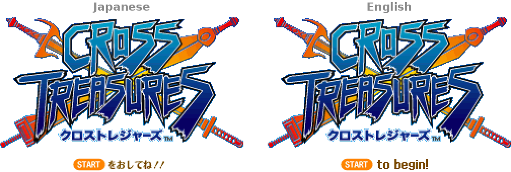
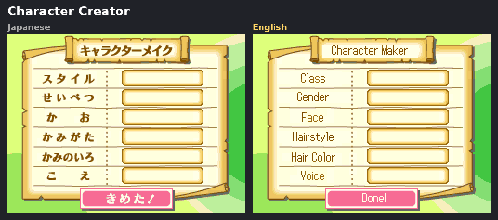
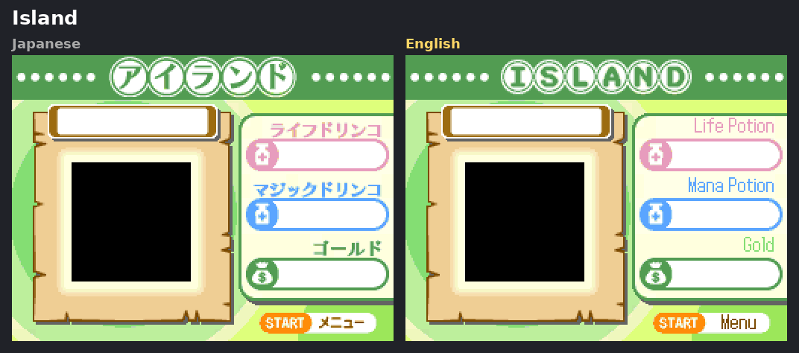
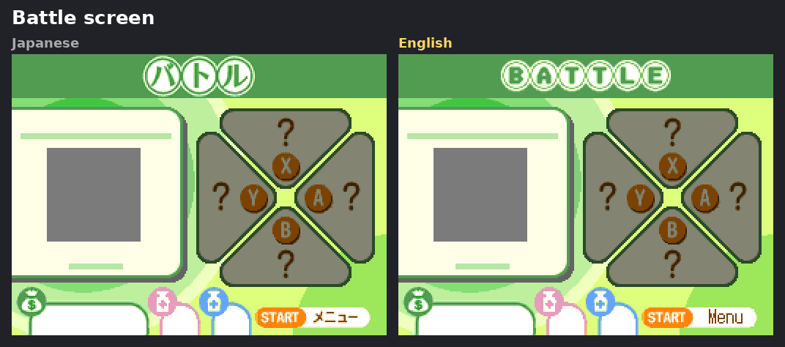
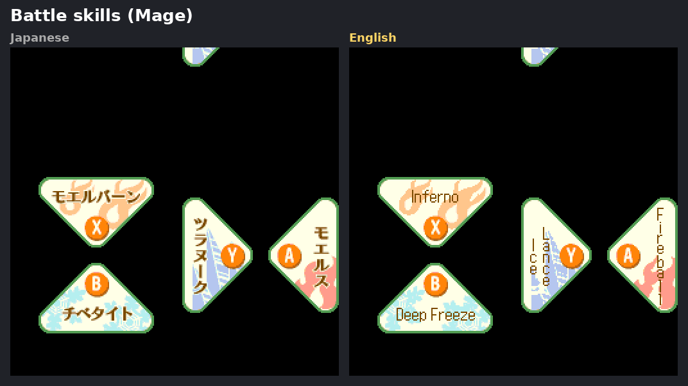
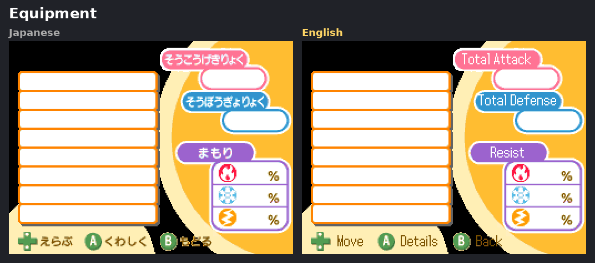
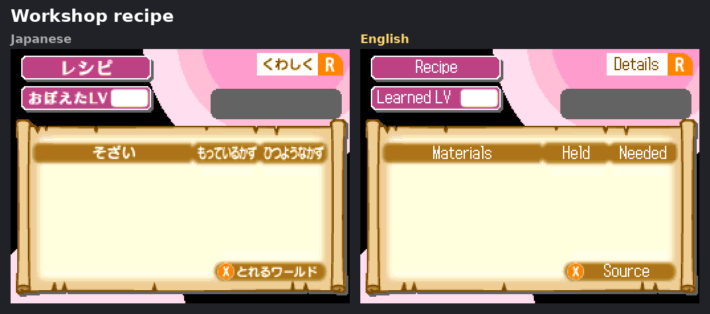
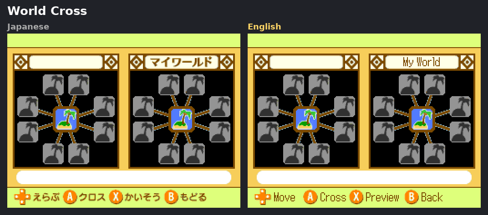
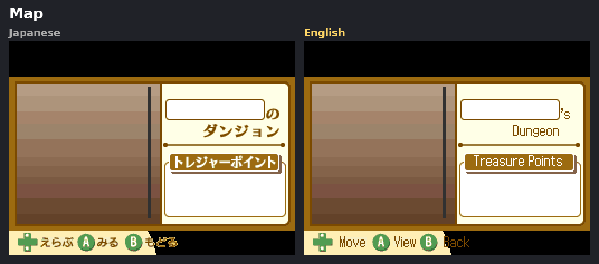

# Cross Treasures -- English Translation

A complete fan translation of **Cross Treasures** (クロストレジャーズ, Square Enix,
Nintendo DS, 2008), a dungeon-crawling action RPG that never left Japan.

**Version 1.0** -- fully translated. Everything found so far is fixed, but not
everything has been seen in a full playthrough yet. Later versions will fix
what turns up. See [Feedback](#feedback-and-reporting-problems).

## Patching

You need your own dump of the Japanese game. This project does not distribute
ROMs. You will need to do an advanced search of your own rom lair to grab it.

Either of the two common dumps works -- check yours (how: see
[Installing the Patch](../../wiki/Installing-the-Patch)), then pick the matching
patches:

| Your dump (`Cross Treasures (Japan).nds`, 67,108,864 bytes) | SHA-1 | Patches |
|---|---|---|
| The standard dump (CRC32 `44109EE3`) | `4048b18f3e589e70e58391927c82ca87117d1337` | the plain ones |
| The "2CH" dump (same game, header signature blanked) | `87282a19f8e382b86b5a71714dc9d8dbc7a1126c` | the `_2CH` ones |

Download from the [Releases page](../../releases):

| Patch | For |
|---|---|
| **`CrossTreasures_T+En_by_UrDone4_v1.0.xdelta`** | **recommended** -- includes the built-in friends (see below) |
| `CrossTreasures_T+En_by_UrDone4_v1.0_NoFriends.xdelta` | the same translation without them, for the original experience |
| `CrossTreasures_T+En_by_UrDone4_v1.0_2CH.xdelta` | the recommended patch, for the 2CH dump |
| `CrossTreasures_T+En_by_UrDone4_v1.0_2CH_NoFriends.xdelta` | the NoFriends patch, for the 2CH dump |

Both dumps give the same translated game. Apply the patch with any xdelta
tool (Delta Patcher, xdelta UI, [Rom Patcher JS](https://www.marcrobledo.com/RomPatcher.js/),
or `xdelta3 -d -s "Cross Treasures (Japan).nds" <patch> <output>.nds`). If
the patcher says the source doesn't match, you have the other dump -- don't
force it, or the game will be subtly corrupted.

Tested on a real 3DS with a flash cart, in melonDS on Windows and Android,
and in Manic Emu on iOS. It runs everywhere, but it's an action game: on a
phone, a controller makes it far more playable than touch controls.

## What's translated

Everything we could find: the full story and every NPC (about 24,000 lines),
menus, items, equipment, monsters, skills, recipes, medals, the Almanac, the
staff credits, the secret passwords, and the text baked into the graphics --
title screen, menus, banners, hint strips, and the battle-screen skill art,
redrawn by hand so the English sits on clean artwork.

## Before and after

Japanese on the left, English on the right (rendered from the game's own
graphics, 2x). Note: Black in these images is transparency, and has moving 
in-game graphics behind it. 

## Playable alone

Parts of the original are locked behind local wireless play with other
people: stone monuments that only open once you have connected with enough
friends who have cleared deep enough, the King's Cross Medal, and dungeon
themes (and the items only found there) that exist only on other players'
worlds. In 2026 that means most players could never see them.

The main patch adds **eight built-in friends**. They join one at a time as
your own best floor rises, each with their own name, birthday, look, class and
island, and gear that improves with the floor they join at. Their worlds
between them cover every dungeon theme, so every item source is reachable, and
the monuments and medals can all be earned solo. Nothing is handed to you:
each monument still needs you to reach its floor yourself.

Real multiplayer still works. Prefer the original? Use the NoFriends patch.

## Quality-of-life changes

Small changes where a straight translation would have left English players
worse off than Japanese ones:

* **Passwords in English.** The 45 secret passwords were printed in magazines
  and on a long-gone website. They are now short English phrases with the
  same rewards, and the full list ships with the patch ([PASSWORDS.md](PASSWORDS.md)).
* **The name keyboard opens on the English letters**, and the "Random!" name
  button picks English names.
* **Equipment effects** keep their short tags (Refl, Thd, HP↑ ...), with the
  full effect always spelled out beside them.

## Keeping the original's spirit

The aim throughout was the game as its Japanese players knew it, in English --
not a rewrite.

* **The art keeps its look.** Menu titles are rebuilt in the original's own
  chunky, outlined lettering; banners keep their circled letters; hint words
  sit where the Japanese did, pixel for pixel. The battle-screen skill art was
  redrawn by hand under the English rather than patched over.
* **Tone over literalism.** Jokes, puns and the game's playful monster and
  item names are adapted into English equivalents rather than translated word
  for word, and the characters keep their voices.
* **Where 1:1 wasn't possible,** the change is as small as it can be. The
  screen space is fixed: some names had to fit 16 letters, and some labels
  only 3. Japanese passwords were word puzzles, so the English ones are new
  phrases. Where a short form was unavoidable, the full text is shown next to
  it.

## Known limitations

* **Co-op Quest guests (Download Play) stay Japanese.** The programs the host
  DS sends to guests are digitally signed; changing them would stop them
  booting on a real DS. The host's own game is fully English. Likely a feature
  that wont be used often at this point in time anyway. 
* Not every late-game scene has been seen in play yet -- if something reads
  oddly, it probably hasn't been.

## Feedback and reporting problems

Feedback is welcome. Please [open an issue](../../issues) on GitHub for
anything you find: untranslated text, text running out of its box, graphical
glitches, a line that reads oddly, or a suggestion. A screenshot and where you
were (floor, menu, or scene) help a lot.

I'll read every report and fix what I can in future versions. I can't
promise every change, though: some are limited by what the game itself
allows (fixed screen space, graphics that can't grow), and this is a
one-person hobby project.

## About AI use

**Could I have done this without AI?** Yes.

**Would I have done this without AI?** No.

This translation was made with help from AI (Claude, by Anthropic).

If you don't like AI, you can stop here. This was always a project for me,
solely; I'm only sharing it for others who might enjoy it.

The longer version: without it, this project would not exist. I came to this game as a
*player*: I found Cross Treasures on YouTube as an under-appreciated hidden
gem, went to play it, and found it was never fully translated. I have the
software enginerring know-how, but doing it by hand would have meant reading all
24,000 lines and every menu before ever playing the game -- the whole story
spoiled -- on top of taking many times longer. That wasn't worth it to me, and
I would never have started.

AI did the reading and drafting -- translating the script,
and building the tools that decode and repaint the game's formats -- so the
story stayed new to me. It still took a large number of hours on my side: I
directed the work, made the style and naming decisions, hand-redrew the
battle art, and tested every screen on hardware, one screenshot at a time.
But it was a fraction of what it would have been, and I'm now playing the
game fresh. That playthrough is how the remaining issues will be found.

## Building from source

This repository holds everything needed to build the patch yourself -- the
tools, the English translation and the redrawn art -- but no game data: you
supply your own ROM. See [BUILDING.md](BUILDING.md).

## Credits

* Translation, testing and art: **UrDone4**
* AI assistance: Claude (Anthropic)
* The original game: Square Enix / Project V

Special thanks to **FloofFluff** and **EobardThawne** of the GBAtemp forums.
This translation was made from scratch and doesn't build on their earlier
patch, but their work showed that a full translation of this game was
possible.

## Licence

[MIT](LICENSE): fork it, change it, reuse any of it -- tools, translation or
art -- for anything, with credit. This repository itself stays mine; to
suggest a change, open an issue.

## Legal

This is an unofficial fan project, not affiliated with or endorsed by Square
Enix. Cross Treasures is (c) Square Enix. No ROMs or game files are
distributed here -- only patches, and the tools, translation and art used to
make them. Please support official releases.
